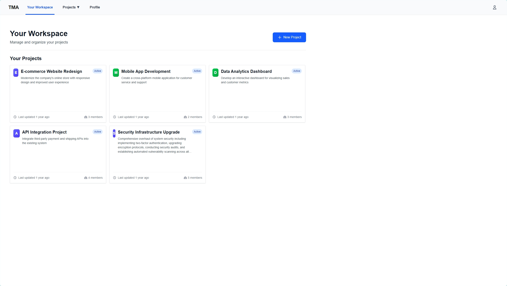

# Task Manager Application

This project is still under development.

## Live Demo

You can play with the application by visiting the following link:

<https://edward1141.xyz/task-manager>

Sometimes the server might be sleeping, so you may need to wait for it to wake up :\)

## Overview

This project is a task manager application that allows you to manage your tasks for your team.




We have make use of the following stack:

- Frontend: Next.js
- Serverless Backend: OpenFaas with java functions
- Database: PostgreSQL
- Caching: Redis

And all the services can be deployed to kubernetes cluster.

## Tools Needed for deployment

### Install docker

<https://docs.docker.com/engine/install>

> note:
login to docker hub afterwards, and you may want to change the docker registry to your own in `task-manager/stack.yaml`, `frontend/deployment/deployment.yaml` and `scripts/frontend_deploy.sh`

### (optional) Install k3d for local kubernetes cluster for development

Optional if you already have a kubernetes cluster or you want to use other methods to create a kubernetes cluster like minikube.

<https://k3d.io/stable/#install-current-latest-release>

### Install kubectl for managing kubernetes cluster

<https://kubernetes.io/docs/tasks/tools/install-kubectl-linux/#install-using-native-package-management>

### Install arkade for CLI tools and Kubernetes Applications (e.g. openfaas)

<https://blog.kubesimplify.com/arkade#heading-installing-arakde>

### Install helm for managing kubernetes applications

<https://helm.sh/docs/intro/install/>

### Install OpenFaas-CLI for managing openfaas

<https://docs.openfaas.com/cli/install/>

### Install envsubst for substituting environment variables in yaml files

```bash
sudo apt-get install gettext-base
```

## OpenFaas Setup

A quick guide to setup openfaas in kubernetes cluster.

### Create a kubernetes cluster with k3d

This will create a kubernetes cluster with 1 server and 3 agents and map the ports 80, 443, 5051, 5052, 8080 for load balancer, 6443 for server.

```bash
k3d cluster create --config kube-config/k3d-config.yaml 
```

### Install openfaas in kubernetes cluster

```bash
arkade install openfaas --load-balancer
```

## Deployment

### Set up the secrets

Put the secrets in the `.secrets` folder under the root of the project.

```bash
# Structure of the folder
.secrets/
├── .env
├── postgresql-secret.env
├── redis-secret.env
├── auth-secret.env
```

.env

```bash
# For access of openfaas and faas-cli to deploy functions
CLUSTER_MACHINE_IP=your_cluster_machine_ip

# For access of frontend to backend, depends on the kubectl port-forward / nginx proxy
PUBLIC_API_URL=your_public_api_url
```

postgresql-secret.env

```bash
DB_USER="postgres"
DB_PASSWORD="your_postgresql_password"
```

redis-secret.env

```bash
REDIS_PASSWORD=your_redis_password
```

auth-secret.env

```bash
AUTH_SECRET_KEY=your_auth_secret_key
# you can also generate a random string by running: openssl rand -base64 32
```

### Add bitnami

```bash
helm repo add bitnami https://charts.bitnami.com/bitnami
helm repo update
```

### Deploy PostgreSQL on kubernetes

```bash
bash scripts/postgresql_deploy.sh
```

After the deployment, please refer to [this guide](./postgredSQL.md) to setup the database.

### Deploy Redis on kubernetes

```bash
bash scripts/redis_deploy.sh

### Deploy Frontend on kubernetes

note: you may need to push your own docker image to docker hub, and change the image name in the `frontend/deployment/deployment.yaml` and `scripts/frontend_deploy.sh`

```bash
bash scripts/frontend_deploy.sh
```

### Deploy the stacks

note: you may need to push your own docker image to docker hub, and change the image name in the `task-manager/stack.yaml`

```bash
bash scripts/openfaas_deploy.sh
```

## Access the Task Manager

After the deployment, you can access the task manager by:

- kubectl port-forward for accessing the frontend and backend, or
- deploy a custom nginx proxy to access the frontend and backend
